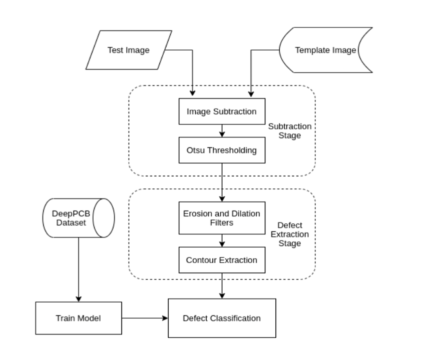
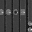
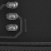
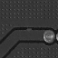
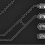
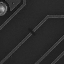
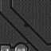
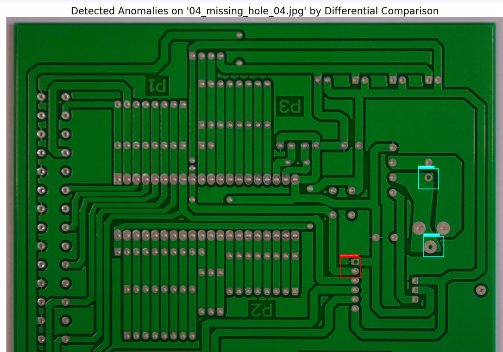

<p align="center">
  
</p>

<h1 align="center">AI PCB Defect Detection & Classification System</h1>

<p align="center">
  <strong>An automated system for detecting and classifying defects in Printed Circuit Boards (PCBs) using image processing and deep learning techniques.</strong>
</p>

<p align="center">
  
  
  
  
  
  
  
</p>

---

## Project Statement

The objective is to develop an end-to-end defect detection and classification system for PCBs. The system:

- Detects and localizes defects using comparison with defect-free templates.
- Classifies detected defects into predefined categories using a trained CNN (ResNet-50).
- Provides a user-friendly frontend for image upload and viewing labeled outputs.
- Exposes a REST API for programmatic integration with other services.
- Integrates a modular backend pipeline for processing images and returning annotated results.
- Exports annotated outputs and detection logs for documentation and analysis.

---

## Features

- Automated defect detection using template-based differential comparison (SSIM).
- Transfer learning-based classification using ResNet-50 trained on DeepPCB dataset.
- Perceptual hashing (pHash) for automatic golden reference matching.
- Batch inference pipeline — classifies patches in batches of 32 for GPU efficiency.
- Input validation with pixel budget limits and file size guards.
- Non-Maximum Suppression (NMS) to eliminate overlapping detections.
- Web-based frontend (Streamlit) for uploading images and viewing predictions in real-time.
- REST API (FastAPI) with `/health` and `/detect` endpoints — structured JSON responses with inference time.
- Environment-based configuration — all settings overridable via `PCB_*` environment variables.
- Persistent rotating log files (10 MB × 5 files) in addition to console output.
- Docker support — Dockerfile + docker-compose for reproducible containerised deployments.
- Annotated image export and CSV-style log generation for analysis.
- Full test suite (24 unit tests) with CI/CD pipeline via GitHub Actions (4 jobs).
- Production-grade code — type hints, structured logging, lazy model loading, zero hardcoded paths.

---

## Tech Stack

| Area | Tools / Libraries |
|---|---|
| Deep Learning | PyTorch, torchvision (ResNet-50) |
| Image Comparison | scikit-image (SSIM), ImageHash (pHash) |
| Image Processing | Pillow, NumPy |
| Frontend | Streamlit |
| REST API | FastAPI, uvicorn, Pydantic |
| Configuration | python-dotenv, environment variables |
| Containerisation | Docker, Docker Compose |
| Visualization | Matplotlib (colormaps) |
| Testing | pytest (24 tests), httpx (API test client) |
| CI/CD | GitHub Actions (lint + typecheck + test + docker) |
| Code Quality | ruff (linter), mypy (type checker) |
| Evaluation | Accuracy, Loss Curves, Confusion Matrix |

---

## Dataset

**DeepPCB Dataset:** [Download from Dropbox](https://www.dropbox.com/scl/fi/4vrtqn7t001yl41oucflu/PCB_DATASET.zip?rlkey=pghz15q2bsg205wynjwsj2c3n&e=2&dl=0)

The model classifies defects into six categories from the DeepPCB benchmark:

| Defect | Description |
|---|---|
| **Missing Hole** | A drill hole that should exist but doesn't |
| **Mouse Bite** | Irregular, jagged edges along copper traces |
| **Open Circuit** | A break or gap in a copper trace |
| **Short** | Unintended copper bridging two traces |
| **Spur** | Small unwanted copper protrusion from a trace |
| **Spurious Copper** | Random copper deposits where there shouldn't be any |

---

## System Workflow

```
AI PCB Defect Detection and Classification System
│
├── 1. Dataset Preparation
│   ├── 1.1 Dataset Collection
│   │   ├── DeepPCB Dataset
│   │   └── Defect-free (Template) Images
│   ├── 1.2 Image Preprocessing
│   │   ├── Image Alignment
│   │   ├── Grayscale Conversion
│   │   ├── Noise Reduction
│   │   └── Normalization
│   └── 1.3 Image Subtraction
│       ├── Template – Test Image Subtraction
│       ├── Thresholding
│       └── Binary Defect Mask Generation
│
├── 2. Defect Localization
│   ├── 2.1 Contour Detection
│   │   ├── Find Defect Contours
│   │   └── Filter Small/Irrelevant Contours
│   ├── 2.2 ROI Extraction
│   │   ├── Bounding Box Generation
│   │   └── Cropped Defect Patches
│   └── 2.3 Defect Visualization
│       ├── Contour Overlay
│       └── Bounding Box Annotation
│
├── 3. Dataset Preparation for Training
│   ├── 3.1 Label Assignment
│   │   ├── Missing Hole
│   │   ├── Spur
│   │   ├── Spurious Copper
│   │   ├── Short
│   │   ├── Open Circuit
│   │   └── Mouse Bite
│   ├── 3.2 Image Resizing
│   │   └── Resize ROIs to 128 x 128
│   └── 3.3 Data Augmentation
│       ├── Rotation
│       ├── Flipping
│       ├── Brightness Adjustment
│       └── Scaling
│
├── 4. Model Training
│   ├── 4.1 Model Selection
│   │   └── Transfer Learning (ResNet50)
│   ├── 4.2 Training Pipeline
│   │   ├── Forward Pass
│   │   ├── Loss Computation
│   │   ├── Backpropagation
│   │   └── Weight Optimization
│   └── 4.3 Model Evaluation
│       ├── Accuracy & Loss Curves
│       ├── Confusion Matrix
│       └── Class-wise Performance
│
├── 5. Inference Pipeline
│   ├── 5.1 Image Upload
│   │   └── Test PCB Image
│   ├── 5.2 Golden Reference Matching
│   │   └── pHash-based Best Match Selection
│   ├── 5.3 Defect Detection
│   │   ├── Sliding Window (128x128, stride 32)
│   │   └── SSIM Comparison (threshold 0.95)
│   ├── 5.4 Defect Classification
│   │   ├── Batch Inference (32 patches/forward pass)
│   │   └── CNN Prediction (confidence > 0.80)
│   └── 5.5 Post-processing
│       ├── Non-Maximum Suppression (IoU 0.2)
│       ├── Bounding Boxes & Labels
│       └── Confidence Scores
│
├── 6. Web Application (Frontend)
│   ├── Streamlit UI
│   │   ├── Image Upload Interface
│   │   ├── Input Validation (16MP limit, 10MB file size)
│   │   ├── Real-time Predictions
│   │   └── Result Visualization
│   └── User Interaction
│       ├── View Annotated Images
│       ├── Detection Results Table
│       └── Download Outputs (PNG + TXT Log)
│
├── 7. REST API
│   ├── GET  /health  — liveness check (returns status + timestamp)
│   └── POST /detect  — upload image, receive JSON detections
│       ├── defect_count
│       ├── inference_time_ms
│       ├── detections (label, confidence, box)
│       └── timestamp
│
├── 8. Backend & Configuration
│   ├── PCBDefectPipeline Class
│   │   ├── Lazy Model Loading
│   │   ├── Cached via @st.cache_resource (Streamlit)
│   │   ├── Batch Inference Module
│   │   └── Annotation Module
│   ├── config.py — Environment-based Settings
│   │   ├── PCB_MODEL_PATH, PCB_GOLDEN_DIR, PCB_LOG_DIR
│   │   ├── PCB_API_HOST, PCB_API_PORT, PCB_MAX_UPLOAD_MB
│   │   └── PCB_LOG_LEVEL
│   └── Logging & Export
│       ├── Rotating File Logs (10 MB × 5 files)
│       ├── Console Logging
│       └── Annotated Image & CSV Log Export
│
├── 9. Testing & CI/CD
│   ├── Unit Tests (24 tests, pytest)
│   │   ├── Input Validation Tests
│   │   ├── Golden Database Tests
│   │   ├── Batch Classification Tests
│   │   ├── Detection Pipeline Tests
│   │   ├── Visualization Tests
│   │   ├── End-to-End Pipeline Tests
│   │   └── REST API Endpoint Tests (health, 400/413/422/200, count match)
│   └── GitHub Actions CI (4 jobs)
│       ├── Lint (ruff)
│       ├── Type Check (mypy)
│       ├── Test (pytest)
│       └── Docker Build (docker build)
│
└── 10. Deployment
    ├── Streamlit UI  → docker-compose up (port 8501)
    ├── REST API      → docker-compose up (port 8000)
    ├── Annotated PCB Image
    ├── Defect Class Labels
    ├── Confidence Scores
    └── Detection Log (CSV)
```

---

## Project Modules & Milestones

### Milestone 1: Dataset Preparation and Image Processing

**Module 1: Dataset Setup and Image Subtraction**
- Aligned and preprocessed template-test image pairs.
- Applied image subtraction and thresholding to highlight defects.
- **Deliverables:** Cleaned dataset, subtraction scripts, sample defect-highlighted images.

**Module 2: Contour Detection and ROI Extraction**
- Detected contours of defects and extracted ROI for model training.
- **Deliverables:** ROI extraction pipeline, labeled defect samples, visualization of contours.

**Results:**

| Missing Hole | Spurious Copper |
|---|---|
|  |  |

| Spur | Short |
|---|---|
|  |  |

| Open Circuit | Mouse Bite |
|---|---|
|  |  |

---

### Milestone 2: Model Training and Evaluation

**Module 3: Model Training**
- Used transfer learning with ResNet-50 for defect classification.
- Preprocessed and augmented images (128x128) for training over 50 epochs.
- **Deliverables:** Trained model (`best_resnet50_pcb_defects_50epochs.pth`), accuracy/loss metrics, confusion matrix.

**Module 4: Evaluation and Prediction Testing**
- Tested model on unseen images.
- Compared predictions against ground truth annotations.
- **Deliverables:** Annotated test images, final evaluation report.

**Result after inference:**



---

### Milestone 3: Frontend and Backend Integration

**Module 5: Web UI for Image Upload**
- Built Streamlit-based interface for PCB image uploads.
- Displays annotated images with defect labels and confidence scores in real-time.
- Added input validation (10MB upload limit, 16MP pixel cap).

**Module 6: Backend Pipeline for Inference**
- Built `PCBDefectPipeline` class with lazy loading and batch inference.
- Connected backend to Streamlit frontend with `@st.cache_resource` caching.
- **Deliverables:** Full prediction pipeline, annotated outputs, CSV detection logs.

---

### Milestone 4: Testing, Code Quality & CI/CD

**Module 7: Unit Testing**
- Wrote 24 unit tests covering validation, golden DB, batch classification, detection, visualization, end-to-end pipeline, and REST API endpoints.
- Tests use mock models — no `.pth` file needed to run them.

**Module 8: Code Quality & CI/CD**
- Configured ruff linter with strict rules (bugbear, simplify, type-checking).
- Added mypy type checking configuration.
- Set up GitHub Actions CI with 4 parallel jobs: lint, typecheck, test, **docker build**.
- Zero lint warnings, full type annotations across codebase.

**Module 9: REST API, Configuration & Containerisation**
- Built FastAPI REST API (`api.py`) with `/health` and `/detect` endpoints.
- Added `config.py` for centralised, environment-variable-driven configuration.
- Added persistent rotating file logging (`logs/pcb_detection.log`).
- Created `Dockerfile` and `docker-compose.yml` for reproducible deployments.

**Module 10: Documentation & Finalization**
- Comprehensive README with project structure, setup instructions, and results.
- Production-grade codebase with no hardcoded paths, proper error handling, and structured logging.

---

## Project Structure

```
AI_PCB_Defect_Detection_Classification_System/
├── app.py                  # Streamlit web application
├── api.py                  # FastAPI REST API (/health, /detect)
├── inference_new.py        # Detection pipeline (PCBDefectPipeline class)
├── config.py               # Centralised config — env-var overrides for all settings
├── requirements.txt        # Python dependencies
├── pyproject.toml          # Project config (ruff, mypy, pytest)
├── Dockerfile              # Container image definition
├── docker-compose.yml      # Orchestrates API + Streamlit UI services
├── .dockerignore           # Files excluded from Docker build context
├── .env.example            # Template for PCB_* environment variables
├── model/
│   └── best_resnet50_pcb_defects_50epochs.pth
├── PCB_USED/               # Golden reference images
│   ├── 01.JPG
│   ├── 04.JPG
│   └── ...
├── logs/                   # Rotating log files (auto-created on first run)
│   └── pcb_detection.log
├── tests/
│   ├── conftest.py         # Shared test fixtures & mock model
│   ├── test_inference.py   # 15 pipeline unit tests
│   └── test_api.py         # 9 REST API endpoint tests
├── .github/
│   └── workflows/
│       └── ci.yml          # GitHub Actions CI (lint, typecheck, test, docker)
└── image/
    └── README/             # Images used in this README
```

---

## Installation

### Option A — Local (pip)

**1. Clone the repository**
```bash
git clone https://github.com/AradhyaStuti/AI_PCB_Defect_Detection_Classification_System.git
cd AI_PCB_Defect_Detection_Classification_System
```

**2. Create and activate a virtual environment**
```bash
python -m venv my_virtual_env
my_virtual_env\Scripts\activate        # Windows
# source my_virtual_env/bin/activate   # Linux/Mac
```

**3. Install dependencies**
```bash
pip install -r requirements.txt
```

**4. Add your trained model weights**

Place `best_resnet50_pcb_defects_50epochs.pth` inside the `model/` folder.

**5. (Optional) Configure environment**
```bash
cp .env.example .env
# Edit .env to override any PCB_* settings
```

---

### Option B — Docker

**1. Build and start both services**
```bash
docker-compose up --build
```

| Service | URL |
|---|---|
| REST API | `http://localhost:8000` |
| Streamlit UI | `http://localhost:8501` |
| API Docs (Swagger) | `http://localhost:8000/docs` |

**2. Run API only**
```bash
docker build -t pcb-defect-detection .
docker run -p 8000:8000 -v ./model:/app/model:ro pcb-defect-detection
```

---

## How to Use

### Streamlit UI
```bash
streamlit run app.py
```
1. Open `http://localhost:8501` in your browser.
2. Upload a PCB image (JPG/PNG, max 10MB).
3. Click **Run detection**.
4. View results with bounding boxes, defect labels, and confidence scores.
5. Download the annotated image (PNG) and detection log (TXT).

---

### REST API
```bash
uvicorn api:app --reload
```

**Check liveness:**
```bash
curl http://localhost:8000/health
# {"status":"ok","timestamp":"2026-03-24T10:00:00+00:00"}
```

**Detect defects:**
```bash
curl -X POST http://localhost:8000/detect \
  -F "file=@your_pcb_image.jpg"
```

**Example response:**
```json
{
  "defect_count": 2,
  "inference_time_ms": 312.5,
  "detections": [
    {"label": "spur", "confidence": 0.9412, "box": [64, 128, 192, 256]},
    {"label": "open_circuit", "confidence": 0.8871, "box": [320, 64, 448, 192]}
  ],
  "timestamp": "2026-03-24T10:00:01+00:00"
}
```

Interactive API docs (Swagger UI) available at `http://localhost:8000/docs`.

---

## How to Run Tests

```bash
pip install pytest httpx
pytest tests/ -v
```

All 24 tests pass. No model file needed — tests use mock models.

---

## Configuration Reference

All settings can be overridden by setting environment variables or adding them to a `.env` file:

| Variable | Default | Description |
|---|---|---|
| `PCB_MODEL_PATH` | `model/best_resnet50_pcb_defects_50epochs.pth` | Path to model weights |
| `PCB_GOLDEN_DIR` | `PCB_USED/` | Directory of golden reference images |
| `PCB_LOG_DIR` | `logs/` | Directory for rotating log files |
| `PCB_API_HOST` | `0.0.0.0` | API bind address |
| `PCB_API_PORT` | `8000` | API port |
| `PCB_MAX_UPLOAD_MB` | `10` | Maximum upload file size (MB) |
| `PCB_LOG_LEVEL` | `INFO` | Logging level (DEBUG/INFO/WARNING/ERROR) |

---

## How the Detection Pipeline Works

```
Input Image ──> pHash Match ──> SSIM Comparison ──> Batch CNN Classification ──> NMS ──> Annotated Output
                    │                  │                       │
              Golden DB          Threshold=0.95         Confidence>0.80
```

**Step 1 — Golden Reference Matching:** The system finds the closest matching reference image from the golden database using perceptual hashing (pHash).

**Step 2 — Sliding Window + SSIM:** A 128x128 pixel window slides across both images. Structural similarity (SSIM) is computed for each position. Regions with SSIM < 0.95 are flagged as anomalous.

**Step 3 — Batch Classification:** All suspicious patches are collected and classified through ResNet-50 in batches of 32. This is significantly faster than classifying one patch at a time.

**Step 4 — Non-Maximum Suppression:** Overlapping detections are filtered using NMS (IoU threshold = 0.2) to produce clean final results.

---

## Key Architecture Decisions

- **Lazy Loading** — Model and golden database load only on first inference call. Importing the module has zero side effects.
- **`@st.cache_resource`** — Pipeline singleton survives Streamlit reruns. Model doesn't reload on every button click.
- **Batch Inference** — Patches classified in batches of 32 instead of one-by-one. Major speed improvement on GPU.
- **Input Validation** — 16MP pixel budget and 10MB upload limit prevent OOM crashes.
- **Relative Paths via `config.py`** — All paths default to project-relative locations and are overridable via environment variables. No hardcoded absolute paths anywhere.
- **Persistent Rotating Logs** — `configure_logging()` sets up both console and file handlers. Log files rotate at 10 MB, keeping the last 5.
- **REST API Layer** — `api.py` provides a clean HTTP interface over the same `PCBDefectPipeline`, decoupling the UI from the inference logic.
- **Environment-Based Config** — `config.py` reads all settings from `PCB_*` env vars with sensible defaults. Supports `.env` files via python-dotenv.

---

## What I Did in My Internship

This was my internship project. The goal given to me was to build an AI-based system that can automatically detect and classify defects on PCB boards. I had to go through the full cycle — from dataset preparation to model training to building a working web app. Here's everything I did:

- Studied the DeepPCB dataset and understood the 6 defect categories.
- Preprocessed and aligned template-test PCB image pairs.
- Implemented image subtraction and thresholding to highlight defect regions.
- Built contour detection and ROI extraction pipeline to isolate individual defects from the subtracted images.
- Labeled and organized the extracted ROIs into class-wise folders for training.
- Applied data augmentation (rotation, flipping, brightness, scaling) to balance the dataset.
- Trained a ResNet-50 model using transfer learning on the 6 defect classes for 50 epochs.
- Evaluated model performance using accuracy/loss curves and confusion matrix.
- Designed the sliding window + SSIM comparison approach to detect where defects are on a full PCB image.
- Built the Streamlit web app where you can upload a PCB image, run detection, and see annotated results.
- Connected the inference backend to the frontend to make the full pipeline work end-to-end.
- Added download functionality for annotated images and detection logs.
- Documented the full workflow, milestones, and deliverables.

---

## What I Built on My Own (Beyond the Internship Requirements)

After the internship work was done, I wasn't happy with the code quality. It worked, but it wasn't something I'd be proud to show in an interview or put on my resume as-is. So I spent extra time and rewrote major parts of the project to make it production-grade. None of this was required — I did it because I wanted to learn how real engineers write code.

### Rewrote the entire inference pipeline

The original `inference_new.py` was a flat script with everything running at module level. I redesigned it into a proper `PCBDefectPipeline` class:

| What I Changed | Before (Internship Version) | After (My Improvement) |
|---|---|---|
| **File paths** | Hardcoded `C:\Users\User\...` absolute paths | Relative paths via `config.py` env vars — works on any machine |
| **Model loading** | Loaded at import time, crashed if path was wrong | Lazy-loaded inside the class, loads only when you actually run inference |
| **Inference speed** | Classified one patch at a time (slow) | Batch inference — 32 patches in one forward pass, way faster on GPU |
| **GPU memory** | No `torch.no_grad()`, gradients accumulating for nothing | Proper `no_grad` context, clean memory usage |
| **Error handling** | Bare `except:` catching every error silently | Specific `OSError` catches, custom `ImageTooLargeError` exception |
| **Logging** | `print()` with emojis everywhere | Python `logging` module — console + rotating file output |
| **SSIM computation** | `ssim(full=True)` — allocating a diff image nobody used | `full=False`, saves memory on every window comparison |
| **Matplotlib** | Deprecated `plt.cm.get_cmap()` | Updated to `plt.colormaps["hsv"]` |
| **Softmax** | Computed twice per patch in some code paths | Single forward pass, single softmax — no wasted computation |
| **Type safety** | Zero type hints | Full type annotations, `TypedDict` for detection results |
| **Input validation** | Nothing — a 100MP image could crash the server | 16MP pixel cap, minimum size check, 10MB upload limit in the app |
| **Streamlit caching** | Model reloaded from disk on every button click | `@st.cache_resource` keeps the pipeline alive across reruns |
| **Datetime** | Naive `datetime.now()` | Timezone-aware `datetime.now(tz=timezone.utc)` |

### Added a REST API

Built `api.py` using FastAPI:

- `GET /health` — liveness check, returns status and timestamp.
- `POST /detect` — accepts a PCB image upload, returns structured JSON with defect count, inference time in milliseconds, and per-detection bounding boxes, labels, and confidence scores.
- Pydantic response schemas for automatic validation and OpenAPI documentation at `/docs`.
- Proper HTTP status codes: 400 (bad image), 413 (oversized), 422 (validation error), 500 (inference failure).

### Added environment-based configuration

Built `config.py` to centralise all settings:

- Every path, port, file size limit, and log level is readable from a `PCB_*` environment variable.
- Supports `.env` files via python-dotenv (optional dependency).
- `configure_logging()` sets up both a console handler and a rotating file handler — logs persist to `logs/pcb_detection.log` and rotate at 10 MB, keeping 5 backups.
- Both `app.py` and `api.py` call `configure_logging()` at startup. No more stdout-only logs that disappear.

### Added Docker support

- `Dockerfile` — single-stage build from `python:3.11-slim`, installs dependencies with layer caching, exposes both API (8000) and Streamlit (8501) ports.
- `docker-compose.yml` — orchestrates both services. UI depends on API health check passing before starting. Model and golden reference directories are mounted read-only.
- `.dockerignore` — excludes git history, notebooks, cache dirs, and `.env` to keep the image lean.

### Added a full test suite

Wrote 24 unit tests from scratch using pytest. The tests use mock models so you don't need the actual `.pth` file to run them:

**Pipeline tests (15):**
- Input validation (accepts normal images, rejects too small/too large)
- Golden database (loads images, skips non-images, handles empty directory)
- Batch classification (single patch and batch of 4)
- Anomaly detection (identical images = 0 detections, different images = detections found, boxes stay within image bounds)
- Visualization (returns a copy, actually draws boxes)
- Full pipeline end-to-end (returns correct types, validates input)

**API tests (9):**
- Health endpoint (200 OK, `status: ok`, timestamp present)
- Detect endpoint (422 missing file, 413 oversized, 400 bad image, 422 small image, 200 valid response, defect count matches detections list)

All 24 pass.

### Set up CI/CD and code quality tools

- Created `pyproject.toml` with ruff linter config (strict rules — bugbear, simplify, type-checking imports).
- Added mypy type checking configuration with `disallow_untyped_defs`.
- Built a GitHub Actions CI pipeline with **4 parallel jobs**: lint, typecheck, test, **docker build**.
- Fixed every single lint warning — the codebase is completely clean.

### Cleaned up the Streamlit app

- Removed dead imports and commented-out code.
- Added proper error handling around inference calls.
- Added file size validation before even opening the uploaded image.
- Added "No defects detected" feedback message.
- Laid out download buttons in columns for better UX.

---

## Future Scope

- Support Vision Transformers (ViT) for higher accuracy.
- Multi-scale sliding window for defects of varying sizes.
- Batch processing of multiple PCB images.
- Real-time video stream defect detection.
- Prometheus metrics endpoint for inference time and error rate monitoring.
- Cloud deployment (AWS/GCP) for industrial production line use.
- Kubernetes manifests for horizontal scaling.

---

## Author

**Aradhya Stuti**

- GitHub: [AradhyaStuti](https://github.com/AradhyaStuti)
- LinkedIn: [aradhya-stuti-9b2b9529a](https://www.linkedin.com/in/aradhya-stuti-9b2b9529a)
